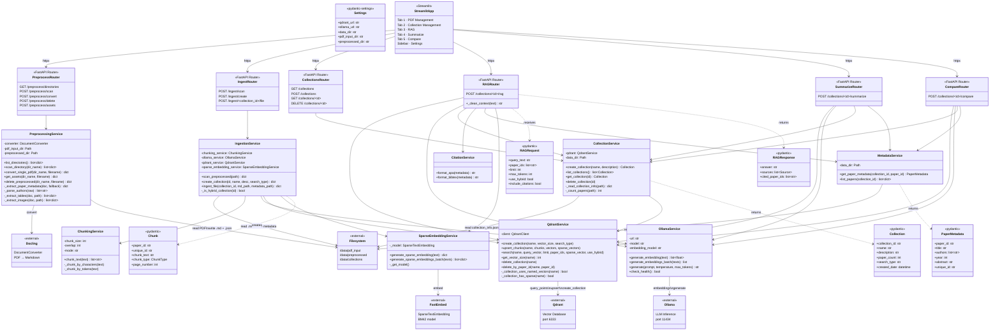

# PRAG-v2 Architecture

```mermaid
classDiagram
    direction TB

    %% ── External Systems ──────────────────────────────
    class Qdrant {
        <<external>>
        Vector Database
        port 6333
    }
    class Ollama {
        <<external>>
        LLM Inference
        port 11434
    }
    class Filesystem {
        <<external>>
        /data/pdf_input
        /data/preprocessed
        /data/collections
    }
    class Docling {
        <<external>>
        DocumentConverter
        PDF → Markdown
    }
    class FastEmbed {
        <<external>>
        SparseTextEmbedding
        BM42 model
    }

    %% ── Configuration ─────────────────────────────────
    class Settings {
        <<pydantic-settings>>
        +qdrant_url: str
        +ollama_url: str
        +data_dir: str
        +pdf_input_dir: str
        +preprocessed_dir: str
    }

    %% ── Data Models ───────────────────────────────────
    class Collection {
        <<pydantic>>
        +collection_id: str
        +name: str
        +description: str
        +paper_count: int
        +search_type: str
        +created_date: datetime
    }
    class PaperMetadata {
        <<pydantic>>
        +paper_id: str
        +title: str
        +authors: list~str~
        +year: int
        +abstract: str
        +unique_id: str
    }
    class Chunk {
        <<pydantic>>
        +paper_id: str
        +unique_id: str
        +chunk_text: str
        +chunk_type: ChunkType
        +page_number: int
    }
    class RAGRequest {
        <<pydantic>>
        +query_text: str
        +paper_ids: list~str~
        +limit: int
        +max_tokens: int
        +use_hybrid: bool
        +include_citations: bool
    }
    class RAGResponse {
        <<pydantic>>
        +answer: str
        +sources: list~Source~
        +cited_paper_ids: list~str~
    }

    %% ── Services ──────────────────────────────────────
    class QdrantService {
        -client: QdrantClient
        +create_collection(name, vector_size, search_type)
        +upsert_chunks(name, chunks, vectors, sparse_vectors)
        +search(name, query_vector, limit, paper_ids, sparse_vector, use_hybrid)
        +get_vector_size(name) int
        +delete_collection(name)
        +delete_by_paper_id(name, paper_id)
        -_collection_uses_named_vectors(name) bool
        -_collection_has_sparse(name) bool
    }
    class OllamaService {
        -url: str
        -model: str
        -embedding_model: str
        +generate_embedding(text) list~float~
        +generate_embeddings_batch(texts) list
        +generate(prompt, temperature, max_tokens) str
        +check_health() bool
    }
    class SparseEmbeddingService {
        -_model: SparseTextEmbedding
        +generate_sparse_embedding(text) dict
        +generate_sparse_embeddings_batch(texts) list~dict~
        -_get_model()
    }
    class ChunkingService {
        -chunk_size: int
        -overlap: int
        -mode: str
        +chunk_text(text) list~str~
        -_chunk_by_characters(text)
        -_chunk_by_tokens(text)
    }
    class CollectionService {
        -qdrant: QdrantService
        -data_dir: Path
        +create_collection(name, description) Collection
        +list_collections() list~Collection~
        +get_collection(id) Collection
        +delete_collection(id)
        -_read_collection_info(path) dict
        -_count_papers(path) int
    }
    class IngestionService {
        -chunking_service: ChunkingService
        -ollama_service: OllamaService
        -qdrant_service: QdrantService
        -sparse_embedding_service: SparseEmbeddingService
        +scan_preprocessed(path) dict
        +create_collection(id, name, desc, search_type) dict
        +ingest_file(collection_id, md_path, metadata_path) dict
        -_is_hybrid_collection(id) bool
    }
    class PreprocessingService {
        -converter: DocumentConverter
        -pdf_input_dir: Path
        -preprocessed_dir: Path
        +list_directories() list~dict~
        +scan_directory(dir_name) list~dict~
        +convert_single_pdf(dir_name, filename) dict
        +get_assets(dir_name, filename) dict
        +delete_preprocessed(dir_name, filename) dict
        -_extract_paper_metadata(doc, fallback) dict
        -_parse_authors(raw) list~str~
        -_extract_tables(doc, path) list~dict~
        -_extract_images(doc, path) list~dict~
    }
    class MetadataService {
        -data_dir: Path
        +get_paper_metadata(collection_id, paper_id) PaperMetadata
        +list_papers(collection_id) list~dict~
    }
    class CitationService {
        +format_apa(metadata) str
        +format_bibtex(metadata) str
    }

    %% ── API Routers ───────────────────────────────────
    class PreprocessRouter {
        <<FastAPI Router>>
        GET /preprocess/directories
        POST /preprocess/scan
        POST /preprocess/convert
        POST /preprocess/delete
        POST /preprocess/assets
    }
    class IngestRouter {
        <<FastAPI Router>>
        POST /ingest/scan
        POST /ingest/create
        POST /ingest/~collection_id~/file
    }
    class CollectionsRouter {
        <<FastAPI Router>>
        GET /collections
        POST /collections
        GET /collections/~id~
        DELETE /collections/~id~
    }
    class RAGRouter {
        <<FastAPI Router>>
        POST /collections/~id~/rag
        +_clean_context(text) str
    }
    class SummarizeRouter {
        <<FastAPI Router>>
        POST /collections/~id~/summarize
    }
    class CompareRouter {
        <<FastAPI Router>>
        POST /collections/~id~/compare
    }

    %% ── Frontend ──────────────────────────────────────
    class StreamlitApp {
        <<Streamlit>>
        Tab 1 · PDF Management
        Tab 2 · Collection Management
        Tab 3 · RAG
        Tab 4 · Summarize
        Tab 5 · Compare
        Sidebar · Settings
    }

    %% ── Relationships: Services → External ────────────
    QdrantService --> Qdrant : query_points\nupsert\ncreate_collection
    OllamaService --> Ollama : embeddings\ngenerate
    SparseEmbeddingService --> FastEmbed : embed
    PreprocessingService --> Docling : convert
    PreprocessingService --> Filesystem : read PDF\nwrite .md + .json
    CollectionService --> Filesystem : read collection_info.json
    IngestionService --> Filesystem : read .md\nwrite metadata
    MetadataService --> Filesystem : read metadata JSON

    %% ── Relationships: Services → Services ────────────
    CollectionService --> QdrantService
    IngestionService --> ChunkingService
    IngestionService --> OllamaService
    IngestionService --> QdrantService
    IngestionService --> SparseEmbeddingService

    %% ── Relationships: Routers → Services ─────────────
    PreprocessRouter --> PreprocessingService
    IngestRouter --> IngestionService
    CollectionsRouter --> CollectionService
    RAGRouter --> QdrantService
    RAGRouter --> OllamaService
    RAGRouter --> CollectionService
    RAGRouter --> CitationService
    RAGRouter --> MetadataService
    RAGRouter --> SparseEmbeddingService
    SummarizeRouter --> QdrantService
    SummarizeRouter --> OllamaService
    SummarizeRouter --> CollectionService
    SummarizeRouter --> MetadataService
    CompareRouter --> QdrantService
    CompareRouter --> OllamaService
    CompareRouter --> CollectionService
    CompareRouter --> MetadataService

    %% ── Relationships: Frontend → Routers ─────────────
    StreamlitApp --> PreprocessRouter : httpx
    StreamlitApp --> IngestRouter : httpx
    StreamlitApp --> CollectionsRouter : httpx
    StreamlitApp --> RAGRouter : httpx
    StreamlitApp --> SummarizeRouter : httpx
    StreamlitApp --> CompareRouter : httpx

    %% ── Relationships: Models used by ─────────────────
    RAGRouter ..> RAGRequest : receives
    RAGRouter ..> RAGResponse : returns
    CollectionService ..> Collection : returns
    IngestionService ..> Chunk : creates
    MetadataService ..> PaperMetadata : returns
```
