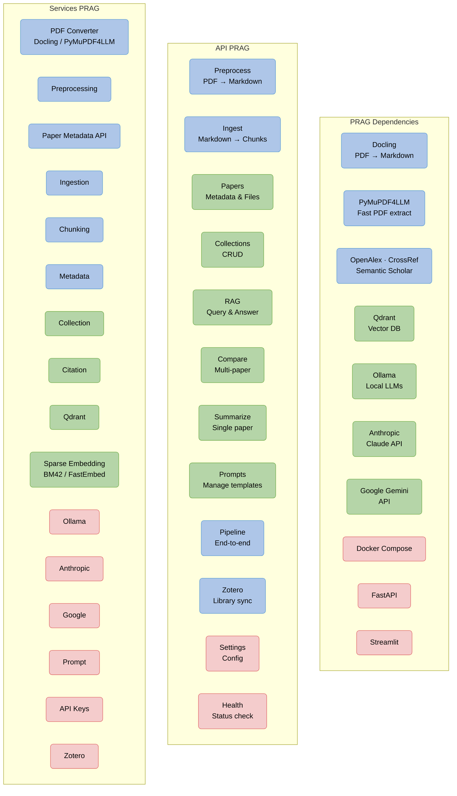

# PRAG Architecture

PRAG is a **Retrieval-Augmented Generation (RAG)** system for academic research papers.
You upload PDFs, organize them into collections, and use local or cloud LLMs to query,
summarize, and compare papers — all through a Streamlit frontend backed by a FastAPI service.

The system is organized in three layers:

- **Dependencies** — external tools and services PRAG relies on
- **API** — HTTP endpoints the frontend (and any external tool) calls
- **Services** — internal logic: PDF conversion, embeddings, chunking, LLM calls, and more

---

## System Overview



---

## API Endpoints

| Endpoint | Method(s) | Description |
|---|---|---|
| `/preprocess` | GET, POST | List directories, convert PDFs to Markdown, manage assets |
| `/ingest` | POST | Scan preprocessed files, create collections, ingest chunks into Qdrant |
| `/papers` | GET, DELETE | List papers in a collection, retrieve or remove metadata |
| `/collections` | GET, POST, DELETE | Create, list, and delete paper collections |
| `/collections/{id}/rag` | POST | Run a RAG query against a collection |
| `/collections/{id}/summarize` | POST | Summarize a single paper using retrieved context |
| `/collections/{id}/compare` | POST | Compare two or more papers side by side |
| `/prompts` | GET | List and retrieve prompt templates by task type |
| `/pipeline` | POST | Run the full preprocess → ingest pipeline in one call |
| `/zotero` | GET, POST | Browse and import papers from a Zotero library |
| `/settings` | GET, PATCH | Read and update runtime configuration (config.yaml) |
| `/health` | GET | Check that Qdrant and Ollama are reachable |

---

## Services

| Service | Responsibility |
|---|---|
| **PDF Converter** | Abstracts Docling and PyMuPDF4LLM; selects the right converter per file |
| **Preprocessing** | Orchestrates PDF → Markdown conversion, extracts tables and images |
| **Paper Metadata API** | Fetches paper metadata from OpenAlex, CrossRef, and Semantic Scholar |
| **Ingestion** | Reads Markdown files, creates chunks, generates embeddings, upserts to Qdrant |
| **Chunking** | Splits text into overlapping chunks by characters or tokens |
| **Metadata** | Reads and writes per-paper JSON metadata from the filesystem |
| **Collection** | Manages collection directories and `collection_info.json` files |
| **Citation** | Formats paper metadata as APA or BibTeX citations |
| **Qdrant** | Wraps the Qdrant client: create collections, upsert, search (dense + hybrid RRF) |
| **Sparse Embedding** | Generates BM42 sparse vectors via FastEmbed for hybrid search |
| **Ollama** | Generates dense embeddings and LLM completions via local Ollama instance |
| **Anthropic** | Calls Anthropic's Claude API as an alternative LLM backend |
| **Google** | Calls Google Gemini API as an alternative LLM backend |
| **Prompt** | Loads, validates, and renders YAML prompt templates with variable substitution |
| **API Keys** | Stores and retrieves cloud API keys (Anthropic, Google) at runtime |
| **Zotero** | Connects to the Zotero Web API to browse and import a user's library |

---

## Data Flow

```
PDF files
   └─▶ Preprocessing (Docling / PyMuPDF4LLM)
          └─▶ Markdown + metadata JSON on disk
                 └─▶ Ingestion
                        ├─▶ Chunking
                        ├─▶ Embeddings (Ollama dense + FastEmbed sparse)
                        └─▶ Qdrant (vector storage)

Query
   └─▶ RAG / Summarize / Compare endpoint
          ├─▶ Qdrant search (dense or hybrid RRF)
          ├─▶ Context assembly + citation formatting
          └─▶ LLM generation (Ollama · Anthropic · Google)
                 └─▶ Answer + sources
```
